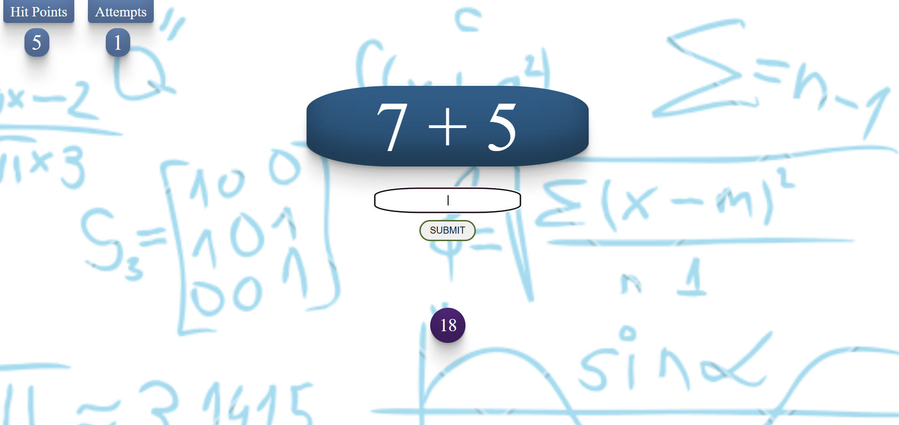

# Math Quiz Game

A simple math quiz game designed to test your arithmetic skills across multiple levels.

## Introduction

Math Quiz Game is an interactive game that challenges players to solve math problems within a specified time limit. The game consists of five levels, each increasing in difficulty. Can you reach the highest level and prove your mathematical prowess?

## Level One

In Level One, players will encounter basic addition and subtraction problems. The objective is to correctly solve as many problems as possible within the given time limit. Players have a limited number of attempts, and if they exceed the maximum number of mistakes or run out of time, they will lose the level.

Instructions:
- Solve the presented math problems by entering the correct answer in the input field.
- Submit your answer by clicking the "Submit" button.
- Earn a point for each correct answer.
- The level is completed when you reach a score of 5.
- Be mindful of the time limit. Each problem must be solved within 20 seconds.
- You have a maximum of 1 mistake allowed. Making 2 mistakes will result in a loss.

## Level Two

Level Two introduces more challenging math problems. The level is designed to test your ability to solve more complex equations within the given time limit. Be prepared for increased difficulty and make sure to manage your mistakes and time wisely.

Instructions:
- Solve the presented math problems by entering the correct answer in the input field.
- Submit your answer by clicking the "Submit" button.
- Earn a point for each correct answer.
- The level is completed when you reach a score of 5.
- Be mindful of the time limit. Each problem must be solved within 30 seconds.
- You have a maximum of 2 mistakes allowed.

## Level Three

To conquer this level, you'll need to demonstrate proficiency in addition and subtraction under high-pressure conditions. Can you achieve a perfect score?

Instructions:
- Solve the presented math problems by entering the correct answer in the input field.
- Submit your answer by clicking the "Submit" button.
- Earn a point for each correct answer.
- The level is completed when you reach a score of 5.
- Be mindful of the time limit. Each problem must be solved within 50 seconds.
- You have a maximum of 2 mistakes allowed.

# Level Four

Level Four introduces larger numbers in the range of 100 to 499. This level will test your arithmetic skills with addition and subtraction. Prepare yourself for more complex equations and try to maintain accuracy and speed.

Instructions:

- Solve the presented math problems by entering the correct answer in the input field.
- Submit your answer by clicking the "Submit" button.
- Earn a point for each correct answer.
- The level is completed when you reach a score of 5.
- Be mindful of the time limit. Each problem must be solved within 70 seconds.
- You have a maximum of 3 mistakes allowed.

# Level Five

Level Five is the final and most challenging level of the Math Quiz Game. In this level, you'll encounter even larger numbers ranging from 500 to 999.

Instructions:

- Solve the presented math problems by entering the correct answer in the input field.
- Submit your answer by clicking the "Submit" button.
- Earn a point for each correct answer.
- The level is completed when you reach a score of 5.
- Be mindful of the time limit. Each problem must be solved within 80 seconds.
- You have a maximum of 3 mistakes allowed.

